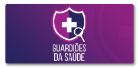
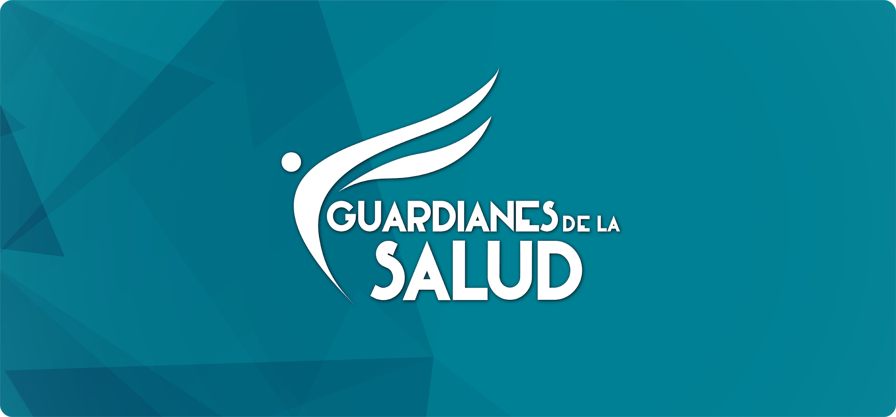
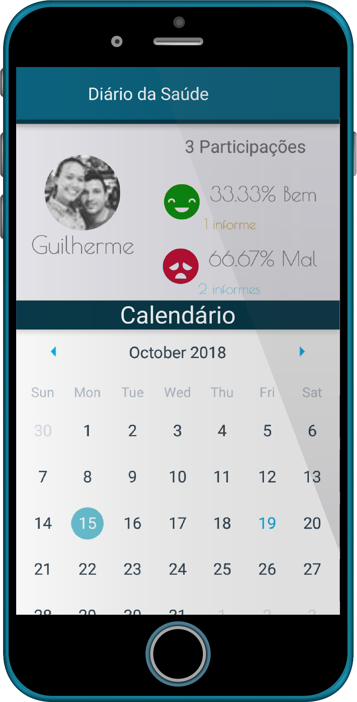
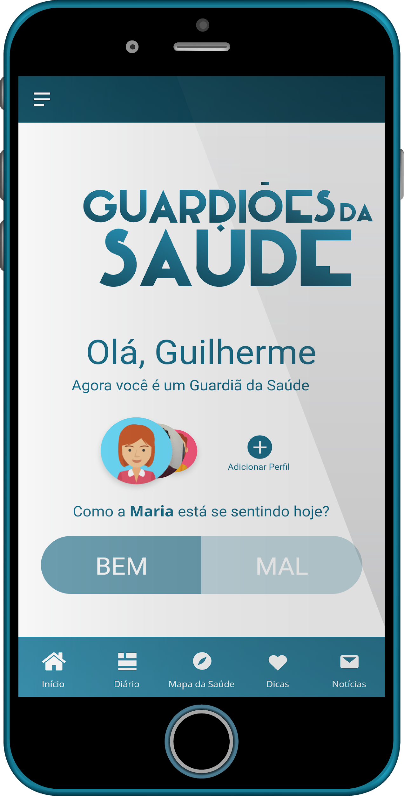
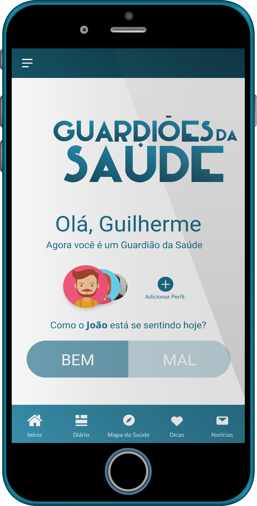

# O que é?

O aplicativo **Guardiões da Saúde** é uma aplicação para dispositivos móveis gratuita e tem como intuito fortalecer a vigilância em saúde, por meio da estratégia da **vigilância participativa**. 

A partir de participações voluntárias dos usuários é possível identificar alterações no padrão epidemiológico das doenças em um determinado local. Assim a população passa de **agente passivo** no processo de vigilância para **agente ativo**, reforçando a importância da participação social. Além de promover a adaptação no âmbito da saúde em moldar-se conforme a necessidade pública de saúde, no que se refere ao aprimoramento da vigilância em saúde por meio da detecção digital de doenças.

# Entendendo a Vigilância em Saúde

## Vigilância em Saúde Pública Tradicional

A Vigilância em Saúde se relaciona às práticas de atenção voltadas para o monitoramento e controle de agravos de importância em saúde pública, seja por meio de **notificação ou busca ativa de casos**. Nesse sentido, a população se torna um **participante passivo** nesse processo e majoritariamente, nesse intervalo entre o adoecimento e a identificação do caso, pode gerar um **potencial risco para saúde pública**. Como maneira de contribuir para o benefício da Vigilância em Saúde, a Vigilância Participativa **oportuniza a situação de saúde rotineira** da população em tempo real.

## Vigilância Participativa

A Vigilância Participativa possibilita o envolvimento da população no processo de Vigilância em Saúde, por meio de **participações voluntárias**, potencializando o fortalecimento da **participação social **(**comunidade colaborativa**). Nesse sentido, a população exerce um **papel ativo** no processo de vigilância e possibilita a identificação de alterações no padrão epidemiológico das doenças, se tornando um** canal complementar** de informações de saúde. 

# Histórico 

O aplicativo é uma proposta desenvolvida no ano de 2007, onde o Ministério da Saúde realizou o monitoramento do seu primeiro evento de massa e iniciou, com eventos importantes e com maior fluxo de estrangeiros entrando e saindo do país foram, respectivamente, a Copa do Mundo FIFA 2014 e as Olímpiadas em 2016, que juntos superaram mais de 4 milhões de espectadores.

Na Copa do Mundo 	FIFA 2014, entre o período de maio a julho foram contabilizados 9.418 downloads do aplicativo, 7.275 cadastros de usuários, 4.672 usuários ativos. Houve 44.029 participações dos 4.672 usuários ativos informando sua condição de saúde.

Em 2015 o aprimoramento do desenvolvimento tecnológico do aplicativo foi realizado por meio da startup Epitrack, sediada em Recife/Pernambuco e a demonstração do aplicativo no evento Epicrowd. 

Em 2016, o aplicativo foi utilizado novamente nos Jogos Olímpicos e Paraolímpicos Rio de Janeiro (Brasil) em parceria entre Skoll Global Threats Fund (SGTF), Ministério da Saúde do Brasil, start-up Epitrack e a A Associação de Profissionais de Epidemiologia de Campo (ProEpi). Além disso, em 2017 a ProEpi teve oportunidade de participar da 15ª Edição da Mostra Nacional de Experiências Bem-Sucedidas em Epidemiologia, Prevenção e Controle de Doenças (Expoepi) em Brasília (Brasil) para demonstração e promoção do aplicativo. 

Em 2017, o aplicativo recebeu uma nova versão para o país da Colômbia, em especial, para auxílio a visita do papa. Resultado de um trabalho entre parceiros: A Associação de Profissionais de Epidemiologia de Campo (ProEpi) e a Universidade de Brasília, por intermédio do Instituto Nacional de Saúde da Colômbia. O aplicativo recebeu mais de 1 mil downloads.

**Gráfico 01 **- *Apresentação da linha do tempo do aplicativo*

# Atualmente!

A aplicação está voltada para o informe do estado saúde do usuário e de seu parentes, gerando assim um diário da saúde de cada indivíduo, apresentando formas de prevenir doenças e ajudar na localização de instituições de saúde e farmácias.

# Objetivos

* Conhecimento sobre a situação de saúde da população

* Estratégia de detecção de síndromes pela comunidade colaborativa

# Público-alvo

População residente no país.

# Benefícios

* Promover a detecção de possíveis síndromes em tempo oportuno

* Informar a situação de saúde em lugares remotos e em tempo real

* Canal de vigilância, promoção e educação em saúde para a população

# Novas funcionalidades 

* Duas modalidades de perfis 

    * Cadastro de perfil de um usuário "comum", que pode administrar vários perfis secundário.

    * Migração do perfil "comum" para um perfil “profissional de Saúde“, que autoriza o usuário a cadastrar perfis secundários e classificá-los pelo endereço.

* Opção de discagem de para um serviço **emergência**. Após o informe de saúde como "Mal" e apresentado ao usuário a opção de discar para o serviço de emergência local

* Gerenciamento de perfil principal e perfis secundários com mais informações 

* Dashboard - Apresentação da indicação e conexão ao mapa do Healthmap

* Tradução dinâmica

# Desenvolvimento

# API

Uma API é um conjunto padrões de programação que permite a construção de aplicativos cada vez mais leves e rápidos, pois sua utilização permite que serviços sejam apenas executados dentro do aplicativo, tirando a necessidade de criar um código dentro dele para executar tal serviço.

**Por que temos uma API**

Cada administrador necessita acessar o painel de controle do seu aplicativo para ter conseguir inserir e retirar conteúdos e sintomas, além disso ele também precisa conseguir acessar a sua dashboard e todos esses dados precisam ser mostrados no aplicativo. A API consegue unir todas essas necessidades com facilidade uma vez que ao criar serviços (funções) dentro dela, ela consegue buscar informações no banco de dados, tratar essas informações e distribuí-las para o aplicativo e dashboard e maneira fácil e rápida.  

# Método de comunicação 

# Proposta - Agora

No intuito de desenvolvimento do aplicativo para cada país que tiver o interesse em participar dessa colaboração, por meio do desenvolvimento atual, o método de comunicação no que se refere a modificação e personalização da estética do aplicado e inserção de informações e características de cada país, será efetuado mediante o sistema de requisições de alteração no aplicativo. Esse mecanismo se justifica, pois nesse cenário atual, existe uma limitação quanto dispor de autonomia para cada país modificar o seu aplicativo, pois todos os países terão o aplicativo hospedado na mesma base de dados. Ou seja, existe a vulnerabilidade e o risco e ação de terceiros no banco de dados. 

# Mudanças aceitas 

* Paleta de cor do aplicativo

* Portal digital para a seção de notícias

* Dicas de saúde (telefones, informes e local)

# Rotina

**Cadastro:** Para o cadastro será efetuado por meio de um e-mail válido e a senha será um token padrão para cada país. 

**Tempo de resposta da requisição**: após o envio, a resposta será enviada em 48h

**Resposta**: Após requisição modificada, o usuário receberá um e-mail informando que as modificações foram efetuadas.

# Passo a passo

Para ter acesso ao mecanismo de requisições, basta acessar o site da ProEpi ([www.proepi.org.br/xxxxx](http://www.proepi.org.br/xxxxx)) e acessar o ambiente restrito dos Guardiões da Saúde. (definir nome)

1. O usuário administrador de cada países será cadastrado na plataforma, por meio da chave de acesso disponibilizada para cada país.

2. Após o cadastrado, o usuário receberá o login e senha, poderá efetuar o login na plataforma. 
